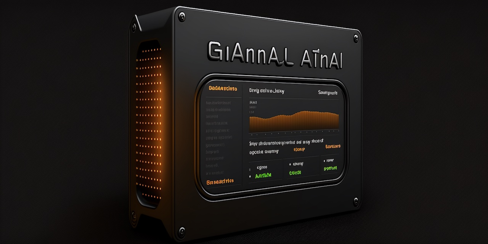

# Grafana Backup Action

<p align="center">
  
</p>

[](https://github.com/zentered/grafana-backup/actions/workflows/publish.yml)

This is a simple GitHub Action to backup Grafana Cloud dashboards.

## Usage

- `GRAFANA_CLOUD_API_KEY` - your Grafana Cloud API key
- `GRAFANA_ORG` - the Grafana organization name
- `OUTPUT_FOLDER` - the folder to save the dashboards to (ie: `backup`)
- `OVERWRITE_FILES` - true to overwrite/update files, false to create
  date-stamped sub-folders

### GitHub Actions

Create a new repository and add the following workflow file to
`.github/workflows/grafana-backup.yml`:

```
name: Grafana Backup

on:
  workflow_dispatch:
  schedule:
    - cron: '0 2 * * *'

jobs:
  grafana-backup:
    runs-on: ubuntu-latest
    steps:
      - uses: actions/checkout@v3
      - name: Grafana Backup
        uses: zentered/grafana-backup@v1.0.2
        env:
          GRAFANA_CLOUD_API_KEY: ${{ secrets.GRAFANA_CLOUD_API_KEY }}
          GRAFANA_ORG: '<your-org>'
          OUTPUT_FOLDER: ''
          OVERWRITE_FILES: true
      - uses: EndBug/add-and-commit@v9
        with:
          default_author: github_actions
```

### Local

Add your API key and the organization name to `.env` (see `.env.example`).

Run `pnpm start` to backup all dashboards to `backup`.

## License

Licensed under [MIT](./LICENSE).
